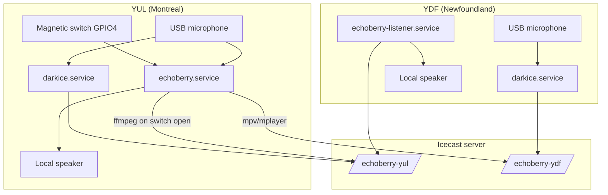
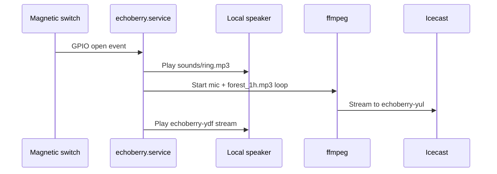

# Architecture

EchoBerry is a two-site audio installation: Montreal (YUL) and Newfoundland (YDF) share live streams through a central Icecast server. YUL is the interactive site — opening the enclosure plays a bell locally and sends voice mixed with looping forest ambience. YDF streams its own microphone continuously and plays the Montreal feed, so each location hears the other across distance.

## System overview



## Locations

| Site | Code | Role |
|------|------|------|
| Montreal | `yul` | Interactive site — opening the enclosure plays a bell, sends voice + forest mix, listens to YDF |
| Newfoundland | `ydf` | Passive/listening site — streams locally, plays YUL on boot |

Location-specific mounts and names live under `locations.*` in `config.yaml`.

## Services by location

### YUL

| Service | Runs | Purpose |
|---------|------|---------|
| `darkice.service` | Always | Continuous mic → `echoberry-yul` mount |
| `echoberry.service` | Always | GPIO listener; on switch **open**: play ring, start ffmpeg (mic + looping forest) → `echoberry-yul`, play `echoberry-ydf` locally |

**Dual streaming (intentional):** darkice keeps a baseline mic stream on the YUL mount. When the switch opens, ffmpeg layers ring + forest ambience onto the same mount. Both are part of the installation design.

### YDF

| Service | Runs | Purpose |
|---------|------|---------|
| `darkice.service` | Always | Continuous mic → `echoberry-ydf` mount |
| `echoberry-listener.service` | Always | Plays `echoberry-yul` stream through local speakers |

## Switch-open sequence (YUL)



On switch **close**, tracked subprocesses are stopped (ffmpeg, mpv/mplayer).

## Configuration flow

```mermaid
flowchart LR
    EX[config.example.yaml] -->|cp| CFG[config.yaml]
    CFG --> RC[scripts/render_configs.py]
    RC --> DARK[conf/darkice.cfg]
    RC --> ICE[conf/icecast.xml]
    RC --> ENV[conf/*.env]
    DARK -->|install.sh| ETC_D[/etc/darkice.cfg]
    ENV -->|install.sh| ETC_E[/etc/echoberry/*.env]
    ICE -->|render_icecast.sh| ICE_SRV[Icecast server]
```

- `config.yaml` is the single source of truth (gitignored).
- Templates in `conf/*.template` are rendered with secrets substituted at install time.
- `install.sh` writes `install.repo_root`, syncs `location`, creates `.venv`, and enables systemd units.

## Audio paths

| File | Used by | Purpose |
|------|---------|---------|
| `sounds/ring.mp3` | `echoberry.service` | Local ring on switch open |
| `sounds/forest_1h.mp3` | ffmpeg in `echoberry.service` | Looped under mic (`forest_stream_loop: -1`) |
| `recording.m4a` | darkice (local) | Intentional archive of live stream |

## Python modules

| Module | Responsibility |
|--------|----------------|
| `src/config.py` | Load and validate `config.yaml`; build stream URLs |
| `src/main.py` | YUL GPIO switch controller |
| `src/audio_player.py` | mpv/mplayer command builder |
| `src/utils.py` | Subprocess cleanup helpers |

## Network ports

| Port | Protocol | Purpose |
|------|----------|---------|
| 8000 (default) | HTTP | Icecast streams and admin UI |

Stream URLs follow `http://<host>:<port>/<mount>`.

## Related docs

- [README.md](../README.md) — deploy from scratch
- [troubleshooting.md](troubleshooting.md) — common failures
- [documentation/README.md](documentation/README.md) — hardware photos
